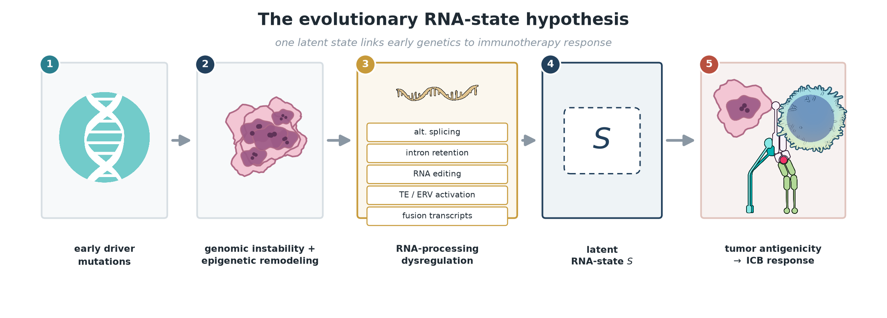

# evolutionary-rna-state

**Reconstructing a latent evolutionary RNA-state of tumors from bulk RNA-seq to organize immune checkpoint blockade (ICB) response.**

*Early driver mutations set a tumor's trajectory; downstream RNA-processing phenotypes are manifestations of one latent state **S** that shapes antigenicity and immunotherapy response. Illustrations: [NIH BioArt](https://bioart.niaid.nih.gov) (NIAID Visual & Medical Arts).*

## Thesis

Early driver mutations set a tumor's evolutionary trajectory. As the tumor
evolves, genomic instability, epigenetic remodeling, RNA-processing
dysregulation, and immune selection combine to produce coordinated
transcriptomic abnormalities — alternative splicing, intron retention, RNA
editing, transposable-element (TE) activation, fusion transcripts, and
cryptic/non-canonical ORFs.

**Core reframing:** these are not independent biomarkers but downstream
manifestations of a single latent *evolutionary RNA-state* **S**. That state —
not any one biomarker — ultimately shapes tumor antigenicity and response to
ICB. Clinical response is one noisy *observable* of where a tumor sits on its
trajectory, not the latent variable itself.

## Falsifiable claims

1. **Co-variation (internal).** The RNA phenotypes above share variance — a
   low-rank structure exists — rather than behaving independently. Tested
   *without reference to response labels.*
2. **Organization (external).** A low-dimensional representation built to
   capture that shared RNA-state variance also stratifies ICB response, and
   does so beyond the field-standard confounders (TMB / expressed-neoantigen
   load, tumor purity, and immune/stromal composition).

## Why bulk RNA-seq, why raw reads

Annotation-based pipelines discard non-reference signal — which is exactly
where evolutionary RNA-state fingerprints live. The design pairs interpretable
expression/signature features with a raw-read encoder branch so both
reference and non-reference signal can contribute to the sample representation.

## Repository layout

| Path | Contents |
|------|----------|
| `data/` | **Metadata only** — manifests, download receipts, run catalog, clinical/response labels. No raw reads (see `data/README.md`). |
| `src/` | Library code (authored in-session). |
| `analysis/` | Analysis scripts / pipeline stages. |
| `notebooks/` | Exploratory notebooks. |
| `results/` | Generated tables and figures (large outputs git-ignored). |
| `docs/` | Data inventory, roadmap, methods notes. |

## Data at a glance

Development/validation centers on pretreatment melanoma ICB RNA-seq with public
raw reads, with additional public IO cohorts inventoried for extension:

- **Gide 2019** (melanoma, anti-PD-1 ± anti-CTLA-4) — ENA `PRJEB23709`
- **Riaz 2017** (melanoma, nivolumab) — SRA/ENA `PRJNA356761` / GEO `GSE91061`
- Additional inventoried cohorts: Zhao/Cloughesy 2019 (GBM), Kim 2018
  (gastric), IMvigor210 (urothelial, processed), TISCH2 (scRNA validation).

See `docs/DATA_INVENTORY.md` and `data/dataset_summary.csv` for the full table,
access levels, and accessions.

## Results & submission

**Headline:** A de-novo antigen-presentation axis built from raw-read RNA
separates ICB responders *within* a cohort (LOO AUROC 0.87) but is
infiltration-driven (ρ=0.77) and does **not** transfer to two independent
held-out cohorts (Riaz 0.36, Hugo 0.58). Standard WES-derived neoantigen
proxies show no structure beyond mutational burden (perm p=0.78) in a
well-powered test. A rigorous cautionary negative that sharpens the hypothesis.

| Deliverable | Path |
|---|---|
| Manuscript (Markdown) | [`docs/WRITEUP.md`](docs/WRITEUP.md) |
| **Manuscript (HTML, linked citations + cartoons)** | [`docs/manuscript.html`](docs/manuscript.html) |
| Mechanistic cartoons (NIH BioArt illustrations) | [`results/cartoon_thesis.png`](results/cartoon_thesis.png), `cartoon_wes_blind.png`, `cartoon_pipeline.png`, `cartoon_confound.png` |
| BioArt icon set + attribution | [`results/bioart_icons/`](results/bioart_icons/) (NIAID Visual & Medical Arts) |
| References (verified DOIs) | [`results/citations.json`](results/citations.json) |
| 100–200 word summary | [`docs/SUMMARY_100-200w.md`](docs/SUMMARY_100-200w.md) |
| Figure deck (8 figs) + supplement | [`results/figure_deck.pdf`](results/figure_deck.pdf), `results/figure_deck_supplement.pdf` |
| Reproducible demo (< 30 s) | [`notebooks/demo_reproduce_headline.ipynb`](notebooks/demo_reproduce_headline.ipynb) |
| How to reproduce everything | [`REPRODUCE.md`](REPRODUCE.md) |
| Demo video script + slideshow | [`docs/VIDEO_SCRIPT.md`](docs/VIDEO_SCRIPT.md), `results/demo_slideshow.gif` |
| Daily-refresh skill | `evolutionary-rna-state-refresh` (published; trigger with "run the refresh") |
| BioArt figure skill | `niaid-bioart` (published; search + download NIH BioArt illustrations for figures) |

## Provenance & compliance

This repository was initialized fresh during the hackathon; all code is
authored in-session. Public-data acquisition is permitted and the committed
`data/` payload is metadata for already-public datasets. See `COMPLIANCE.md`.

## License

MIT — see `LICENSE`.
